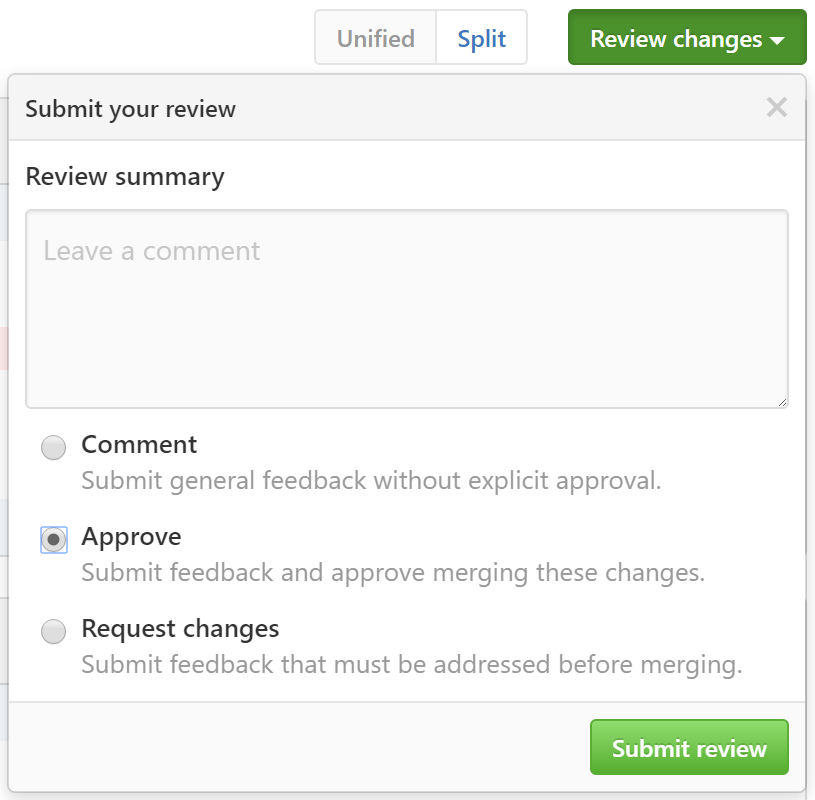

The current maintainers of this repo are [@adamralph](https://github.com/adamralph), [@distantcam](https://github.com/distantcam), and [@HEskandari](https://github.com/HEskandari).

The maintainers [watch](https://github.com/Particular/ServiceInsight/watchers) this repo and undertake the following responsibilities:

- Ensuring that the `master` branch is always releasable. "Releasable" means that the software built from the latest commit contains no known regressions from the previous release and can be released immediately simply by following the [release procedure](https://github.com/Particular/ServiceInsight/blob/master/docs/releasing.md).
  - This does not imply that the latest commit should *always* be released, only that it *can* be, immediately after deciding to release.
- [Releasing](https://github.com/Particular/ServiceInsight/blob/master/docs/releasing.md) new versions of the software.
- Reviewing and merging [pull requests](https://github.com/Particular/ServiceInsight/pulls).
- [Issue backlog](https://github.com/Particular/ServiceInsight/issues) grooming, including the triage of new issues as soon as possible after they are created.
- Managing the repo settings (options, collaborators & teams, branches, etc.).

## Merging pull requests

- A pull request must be approved by two maintainers before it is merged.
  - A pull request created by a maintainer is implicitly approved by that maintainer.
  - Before approving, the maintainer should consider whether a smoke test is required. This is especially important for UI changes, which are not fully covered by automated tests.
  - Approval is given by submitting a review and choosing the **Approve** option: 
  - For some pull requests, it may be appropriate to require a third maintainer to give approval before the pull request is merged. This may be requested by either of the current approvers based on their assessment of factors such as the impact or risk of the changes.
- An approved pull request may be merged by any maintainer.
- The pull request must be made from a branch which is a straight line of commits from `master`. There must be no merges in the branch history since the commit on `master`.
  - The branch does not have to be based on the latest commit in `master` but this is preferable, where practical.
- After a pull request is merged, the milestone representing the next version should be added to:
  - The issue(s) which the PR is addressing, *or*
  - The PR itself, if it is not addressing any pre-existing issue.
