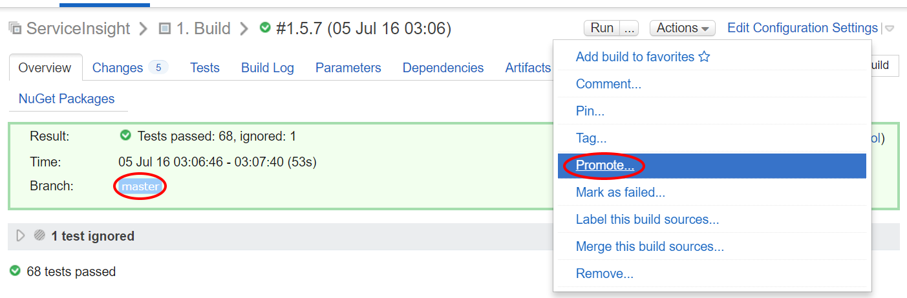
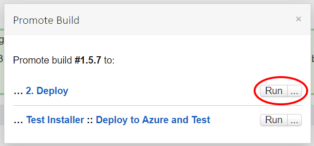
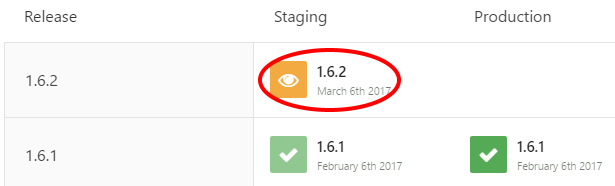
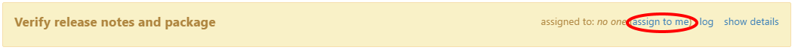
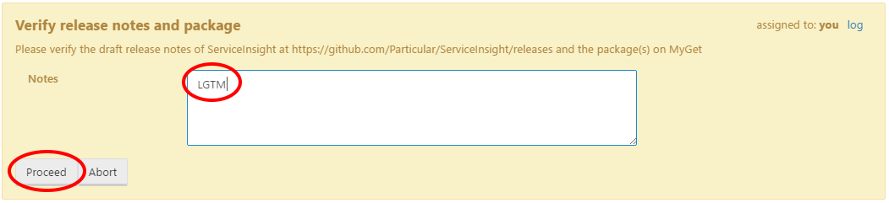

## ServiceInsight releasing procedure

### 1. Merge change

ServiceInsight uses [githubflow](http://gitversion.readthedocs.io/en/latest/git-branching-strategies/githubflow/) for versioning, so there is no `develop` branch. A fix/feature is committed to a branch (there is no convention for naming these branches) and is merged into `master` via a pull request.

By default a merge into master is considered a `patch` increment, if you want to increment the `minor` or `major` instead, merge the PR to a `release-x.y.z` branch (see the "Branch name" section in [the GitVersion docs page](http://gitversion.readthedocs.io/en/latest/more-info/version-increments/)) and then merge the release branch to `master`, or alternatively u can set `next-version` in [the GitVersion YAML file](https://github.com/Particular/ServiceInsight/blob/master/gitversionconfig.yaml) (see the "GitVersion.yml" section in [the GitVersion docs page](http://gitversion.readthedocs.io/en/latest/more-info/version-increments/)).

### 2. Build using TeamCity

Once the change is merged into `master` (**avoid bundling changes, release often instead**) and [the build](https://builds.particular.net/viewType.html?buildTypeId=ServiceInsight_Build&branch_ServiceInsight=<default>) is green, it's time to "Promote" the master build to "Deploy".

**NOTE**: Before you do this, ensure that all the issues/PRs related to this version are associated with the milestone matching the version. Also ensure that **all the issues are closed** and **all the PRs are merged**. Otherwise, either the deployment will fail, or the issues/PRs will not be included in the release notes.

### 3. Deploy using OctopusDeploy

You are now ready to go to [OctopusDeploy](http://deploy.particular.net/app#/projects/serviceinsight).
You should have a new "Staging" build waiting to be released.  

The first step is to proof-read the release notes that were auto generated (it is best to use someone else for this job).

This release notes are generated based on the titles of the issues/PRs associated with the milestone that matches the version you are about to release. By default, the release notes are very "simple". If you want, you can edit them and add extra content to make them more informative and/or appealing.

Once you happy, approve the release notes:

All that is left to do is "Promote to Production".

### 4. Manage GitHub milestones

Ensure that the milestone matching the version which has just been released has been closed.

Open a new milestone for the next version. Initially, the name of the new milestone should be the name of the previous milestone with the patch version (third version part) incremented. This can be altered later if required.
